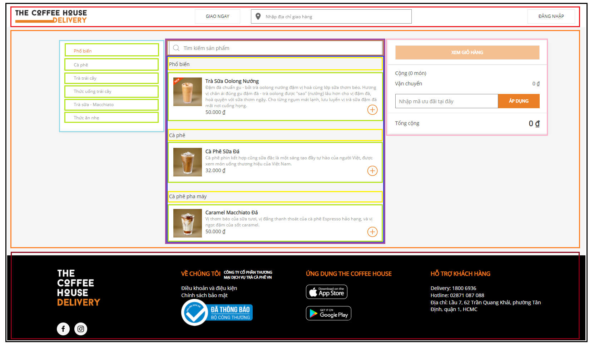

# The Coffee House

## Step 1: Break The UI Into A Component Hierarchy

### 1. Home chứa toàn bộ nội dung website (màu đen)
### 2. Header chứa Logo, form địa chỉ giao hàng, button đăng nhập (màu đỏ)
### 3. Body chứa nội dung của website (màu xanh cam)
#### 3.1 Category: danh mục sản phẩm (màu xanh da trời)
- Category item: danh mục con (màu xanh lá non).
#### 3.2 Products: danh sách sản phẩm (màu tím)
- Input search:  tìm kiếm sản phẩm (màu nâu).
- Product: Sản phẩm (màu xanh dương).
- Category-product: Danh mục của sản phẩm (màu vàng).
- Product-info: Ảnh,thông tin sản phẩm, nút thêm sản phẩm (mày xanh lá).
#### 3.3 Form coupon: mã giảm giá (màu hồng)
#### 4. Footer (màu đỏ nâu).
    
#### 5. Hệ thống phân cấp
Home
    - Header
    - Body
        - Category
            - Category item
        - Products
            - Input search
            - Product
            - Category-product
            - Product-info
        - Form coupon
    - Footer

## Step 2: Build A Static Version in React

